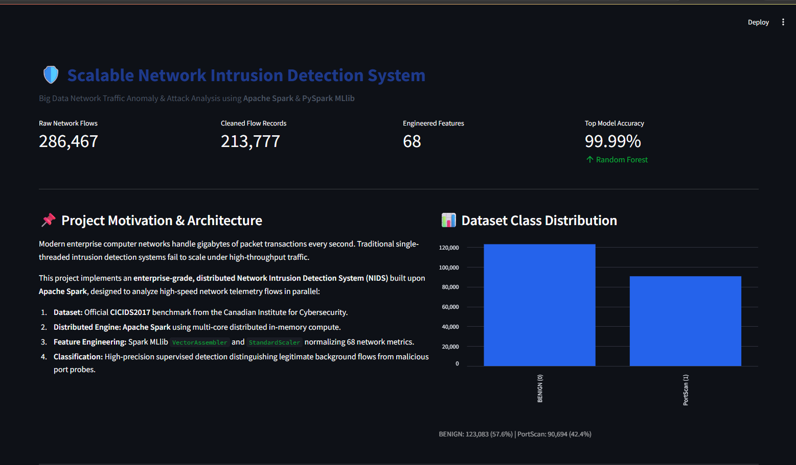
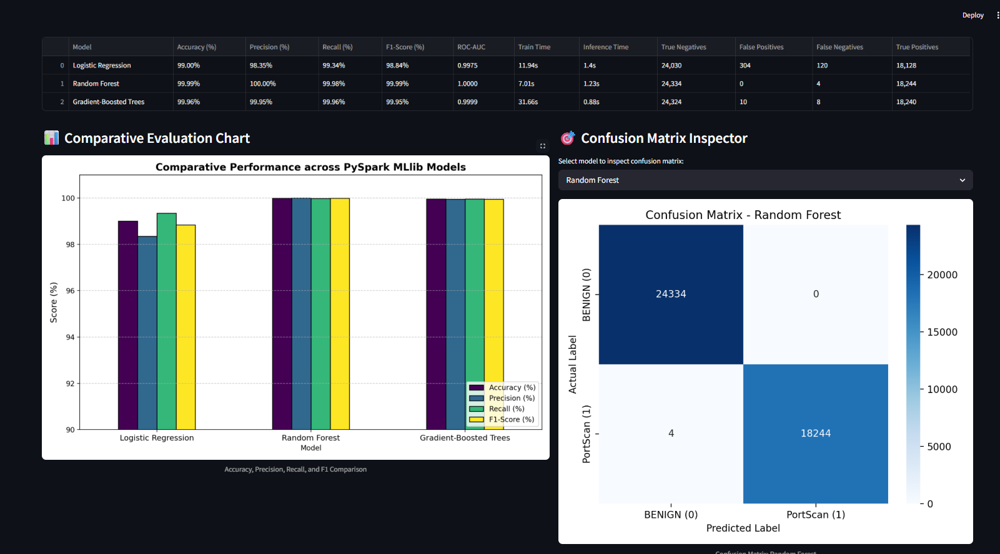
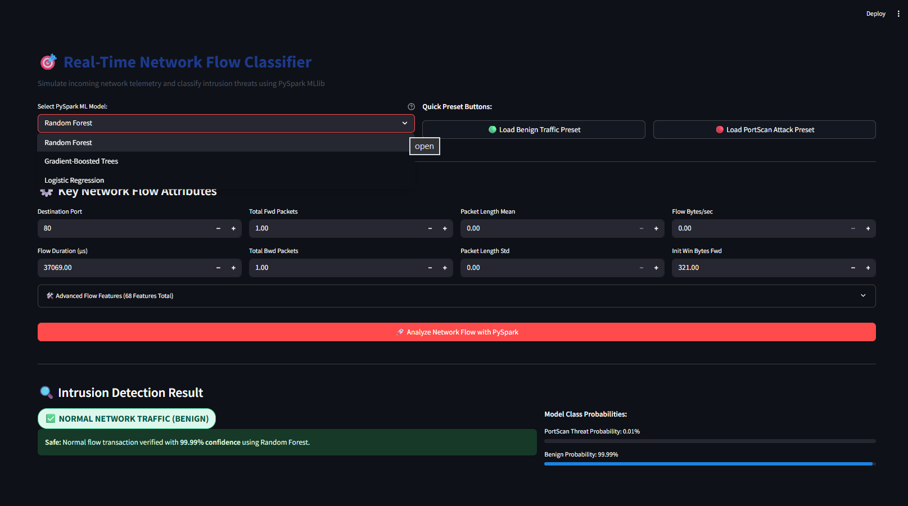
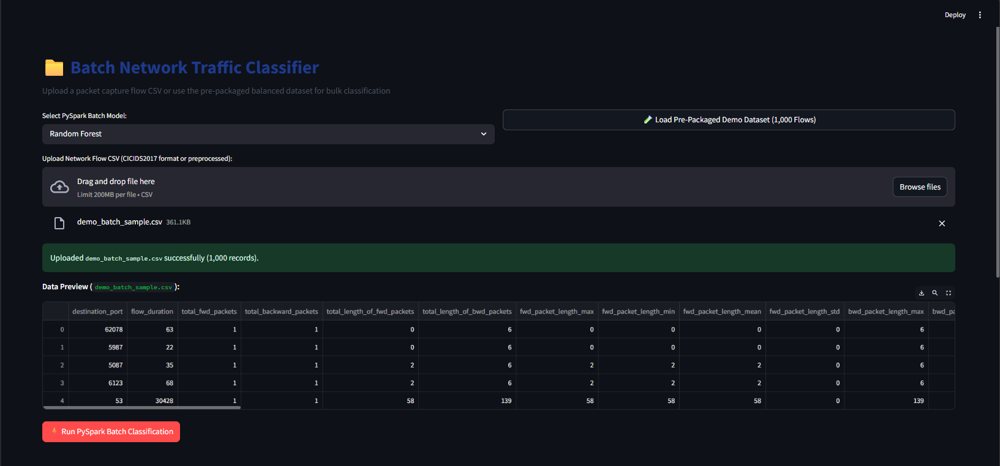
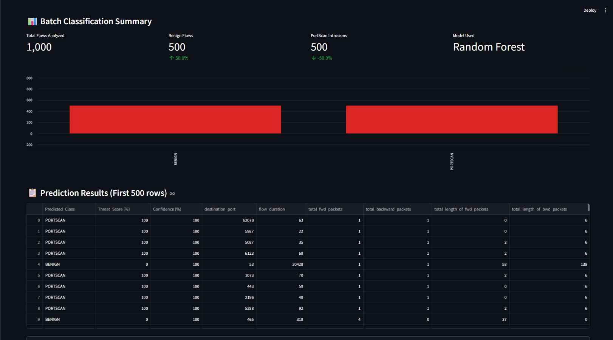

# 🛡️ Scalable Network Intrusion Detection and Anomaly Analysis Using Apache Spark


An end-to-end Big Data cybersecurity mini-project that detects **network port-scanning anomalies at scale** using **Apache Spark (PySpark MLlib)**, running on **Java OpenJDK 17 LTS**, with results explored through an interactive **Streamlit** dashboard.

The project ingests the **CICIDS2017** network-flow dataset, distributes feature engineering and model training across **Apache Spark** (so the pipeline scales beyond what a single-node scikit-learn workflow can handle), trains and benchmarks three **PySpark MLlib** classifiers — **Logistic Regression**, **Random Forest**, and **Gradient-Boosted Trees (GBT)** — and exposes the results through a Streamlit dashboard that supports both **single-flow prediction** and **batch CSV classification**.

> **Scope:** The current models perform **binary classification only** — `BENIGN (0)` vs. `PortScan (1)`. See [Project Scope & Limitations](#️-project-scope--limitations) for details.

---

## ✨ Key Highlights

| | |
| :--- | :--- |
| 📦 **Dataset** | CICIDS2017 — `Friday-WorkingHours-Afternoon-PortScan` partition |
| 🔢 **Features** | 68 engineered network-flow features |
| ⚡ **Engine** | Apache Spark / PySpark MLlib (distributed processing) |
| 🤖 **Models** | Logistic Regression, Random Forest, Gradient-Boosted Trees |
| 🏆 **Best Result** | Random Forest — 99.99% accuracy, 0 false positives |
| 🖥️ **Dashboard** | Streamlit app with live metrics and visualizations |
| 🎯 **Single-Flow Prediction** | Classify one network flow in real time via the UI |
| 📁 **Batch Classification** | Classify an entire CSV of flows with CSV export |
| ✅ **Automated Testing** | End-to-end test suite (`test_end_to_end.py`) |

---

## 📌 Project Overview & Objectives

### Problem Statement
Enterprise networks generate millions of packet-flow transactions every second. Traditional, single-node intrusion detection systems frequently suffer from CPU starvation, high memory overhead, and unacceptably high false alarm rates under heavy network load.

### Project Objective
To build an automated, distributed machine learning intrusion detection pipeline on **Apache Spark** that:
1. Ingests and sanitizes large-scale network telemetry.
2. Extracts and standardizes 68 predictive network flow features.
3. Evaluates three distributed classifiers: **Logistic Regression**, **Random Forest**, and **Gradient-Boosted Trees (GBT)**.
4. Provides a presentation-ready Streamlit web interface for single-flow testing and batch classification.

### How It Works, Simply
For readers new to the project, the pipeline can be summarized as one straight line:

```
Raw CICIDS2017 CSV → Data Cleaning → Feature Processing (Spark) → Spark ML Training → Prediction → Streamlit Dashboard
```

- **Input:** Raw CICIDS2017 network-flow records are loaded from CSV.
- **Cleaning:** Duplicate rows, invalid/infinite values, and zero-variance columns are removed.
- **Feature Processing:** The remaining 68 features are assembled into a single vector and standardized so the models can learn from them fairly.
- **Spark ML:** Three PySpark MLlib classifiers are trained and evaluated in a distributed fashion.
- **Prediction:** The best-performing models are saved and used for inference — one flow at a time, or in bulk.
- **Dashboard:** Streamlit exposes all of the above (metrics, predictions, and visualizations) through a browser-based UI.

---

## 📊 Dataset Description: CICIDS2017

- **Source:** Canadian Institute for Cybersecurity (CIC) / University of New Brunswick (UNB).
- **Target Partition:** `Friday-WorkingHours-Afternoon-PortScan.pcap_ISCX.csv`

| Stage | Count | Notes |
| :--- | :---: | :--- |
| Raw records | 286,467 | Original CSV, 73.34 MB |
| Cleaned records | 213,777 | After duplicate removal and sanitization |
| Predictive features | 68 | After zero-variance pruning |
| Target classes | 2 | `BENIGN (0)`, `PortScan (1)` |

**Classification goal (binary only):**
- `BENIGN` (`0`): Normal enterprise background traffic.
- `PortScan` (`1`): Malicious network reconnaissance and port-scanning probes.

> ℹ️ This project trains on a **single CICIDS2017 partition** and performs **binary classification**. It is **not** a complete, multi-attack CICIDS2017 classifier — see [Limitations](#️-project-scope--limitations).

---

## 🛠️ Technologies Used

| Layer | Component | Version | Role |
| :--- | :--- | :---: | :--- |
| **Distributed Engine** | **Apache Spark** | 3.5.9 | In-memory distributed computation |
| **Java Runtime** | **Microsoft OpenJDK** | 17.0.20 LTS | JVM execution runtime |
| **Machine Learning** | **PySpark MLlib** | 3.5.9 | VectorAssembler, StandardScaler, RF, GBT, LR |
| **Programming Language** | **Python** | 3.12.10 | Core scripting and pipeline orchestration |
| **Web Dashboard** | **Streamlit** | 1.44.1 | Interactive user interface |
| **Data & Metrics** | Pandas, NumPy, Scikit-learn | 2.2, 2.2, 1.8 | Metric evaluation & tabular manipulations |
| **Visualization** | Matplotlib, Seaborn | 3.10, 0.13 | Confusion matrix & comparison charts |

---

## 🏛️ System Architecture

```text
[ Raw CICIDS2017 CSV: 286,467 rows ]
                 │
                 ▼
[ Data Cleaning & Normalization (cleaner.py) ]
 ├── Column header standardization (snake_case)
 ├── Label encoding: BENIGN -> 0, PortScan -> 1
 ├── Duplicate removal (72,353 duplicates filtered)
 ├── Infinite & null value sanitization (337 rows dropped)
 └── Zero-variance feature pruning (10 constant columns removed)
                 │
                 ▼
[ PySpark Distributed Feature Pipeline (feature_pipeline.py) ]
 ├── Train/Test split: 80% Train (171,195 rows) | 20% Test (42,582 rows), seed=42
 ├── VectorAssembler: Combines 68 features into 'raw_features' vector
 └── StandardScaler: Normalizes distributions into 'features' vector
                 │
                 ▼
[ PySpark MLlib Classifiers (train_models.py) ]
 ├── Logistic Regression
 ├── Random Forest Classifier (Top Model: 99.99% Accuracy, 0% FP)
 └── Gradient-Boosted Trees (GBT)
                 │
                 ▼
[ Interactive Streamlit Dashboard (app/app.py) ]
 ├── Overview & Telemetry Metrics
 ├── Comparative Benchmark & Confusion Matrix Viewer
 ├── Real-Time Single Flow Classifier (with 1-Click Presets)
 └── Batch Network Flow Classifier with CSV Export
```

### Stage-by-Stage Roles

| Stage | Component | Role |
| :--- | :--- | :--- |
| Cleaning | `cleaner.py` | Standardizes columns, encodes labels, removes duplicates/invalid rows/constant columns |
| Feature Pipeline | `VectorAssembler` | Combines all 68 numeric features into one `raw_features` vector Spark ML can consume |
| Feature Pipeline | `StandardScaler` | Rescales the assembled vector so all features contribute fairly to model training |
| Modeling | `Logistic Regression` | Linear baseline classifier — fast, interpretable |
| Modeling | `Random Forest` | Ensemble of decision trees — best overall performer in this project |
| Modeling | `GBT (Gradient-Boosted Trees)` | Sequential ensemble — competitive accuracy, fastest inference |
| Interface | `Streamlit` | Renders metrics, single-flow prediction, and batch classification in the browser |

---

## 📁 Project Directory Structure

```text
spark-network-intrusion-detection/
├── app/
│   └── app.py                      # Main Streamlit web application
├── data/
│   ├── raw/                        # Original raw CICIDS2017 CSV dataset
│   └── processed/                  # Cleaned parquet & demo CSV partitions
│       ├── demo_batch_sample.csv   # 1,000-flow balanced demo dataset (500 Benign, 500 PortScan)
│       ├── train.parquet           # 171,195 train flow records
│       └── test.parquet            # 42,582 test flow records
├── hadoop/                         # Windows winutils binaries for Spark File I/O
│   └── bin/
│       ├── hadoop.dll
│       └── winutils.exe
├── notebooks/                      # Exploratory notebooks
├── results/
│   ├── figures/                    # Saved confusion matrices & comparison charts
│   ├── models/                     # Saved PySpark MLlib models & feature pipeline
│   │   ├── feature_pipeline_model/
│   │   ├── logistic_regression_model/
│   │   ├── random_forest_model/
│   │   └── gbt_model/
│   ├── model_comparison.json       # Exact evaluation metrics
│   ├── model_comparison.csv
│   ├── model_comparison.md
│   ├── preprocessing_report.json   # Preprocessing diagnostic report
│   ├── sample_presets.json         # Preset flows for 1-click Streamlit testing
│   └── FINAL_PROJECT_REPORT.md     # Full academic project report
├── src/
│   ├── evaluation/
│   │   └── metrics.py              # Accuracy, Precision, Recall, F1, ROC-AUC, CM plots
│   ├── models/
│   │   ├── predictor.py            # Real-time and batch inference engine
│   │   └── train_models.py         # PySpark model training & evaluation runner
│   ├── preprocessing/
│   │   ├── cleaner.py              # Data cleaning and sanity filtering
│   │   ├── download_dataset.py     # Automated dataset downloader
│   │   ├── feature_pipeline.py     # VectorAssembler & StandardScaler module
│   │   ├── inspect_data.py         # Initial raw dataset diagnostics
│   │   └── run_preprocessing.py    # Master preprocessing runner
│   └── spark/
│       └── spark_session.py        # Reusable SparkSession factory with Windows bindings
├── tests/
│   ├── test_spark_env.py           # Spark smoke test
│   └── test_end_to_end.py          # Automated test suite (6 end-to-end tests)
├── .gitignore
├── README.md                       # Comprehensive project documentation
└── requirements.txt                # Python dependencies
```

---

## 🏆 Model Performance Benchmark

Evaluated on **42,582 independent test records**.

| Metric | What it means here |
| :--- | :--- |
| **Accuracy** | Percentage of all flows (BENIGN + PortScan) correctly classified |
| **Precision** | Of all flows predicted as `PortScan`, the percentage that were actually attacks |
| **Recall** | Of all actual `PortScan` flows, the percentage the model successfully caught |
| **F1-Score** | Harmonic mean of Precision and Recall — a balanced view of both |
| **ROC-AUC** | The model's ability to separate `BENIGN` from `PortScan` across all thresholds |
| **False Positive** | A `BENIGN` flow incorrectly flagged as `PortScan` (false alarm) |
| **False Negative** | A `PortScan` flow incorrectly classified as `BENIGN` (missed attack) |

| Model | Accuracy (%) | Precision (%) | Recall (%) | F1-Score (%) | ROC-AUC | Training Time | Test Inference Time |
| :--- | :---: | :---: | :---: | :---: | :---: | :---: | :---: |
| **Random Forest** ⭐ | **99.99%** | **100.00%** | **99.98%** | **99.99%** | **1.0000** | **7.01s** | 1.23s |
| **Gradient-Boosted Trees** | 99.96% | 99.95% | 99.96% | 99.95% | 0.9999 | 31.66s | **0.88s** |
| **Logistic Regression** | 99.00% | 98.35% | 99.34% | 98.84% | 0.9975 | 11.94s | 1.40s |

Based on these documented metrics, **Random Forest** is the top-performing model overall (highest accuracy, precision, F1-score, and ROC-AUC, with zero false positives), while **GBT** offers the fastest inference time.

### Confusion Matrix Breakdown (42,582 Test Samples)

| Model | True Negatives (BENIGN) | False Positives (False Alarms) | False Negatives (Missed Attacks) | True Positives (PortScans) |
| :--- | :---: | :---: | :---: | :---: |
| **Random Forest** | **24,334** | **0** | **4** | **18,244** |
| **Gradient-Boosted Trees** | 24,324 | 10 | 8 | 18,240 |
| **Logistic Regression** | 24,030 | 304 | 120 | 18,128 |

---

## ⚙️ Installation & Setup

### Prerequisites
- **Python 3.12** installed and available in `PATH`.
- **Java OpenJDK 17 LTS** (required for Apache Spark).

### Step-by-Step Setup (Windows PowerShell)

**1. Clone the repository**
```powershell
git clone <repository-url>
```

**2. Enter the project directory**
```powershell
cd spark-network-intrusion-detection
```

**3. Create a virtual environment**
```powershell
python -m venv venv
```

**4. Activate the virtual environment**
```powershell
.\venv\Scripts\Activate.ps1
```

**5. Install dependencies**
```powershell
python -m pip install -r requirements.txt
```

**6. Verify Java is installed** (required for Spark)
```powershell
java -version
```
If Java is missing, install it with:
```powershell
winget install Microsoft.OpenJDK.17 --source winget --accept-package-agreements --accept-source-agreements
```

**7. Run the Streamlit dashboard**
```powershell
python -m streamlit run app/app.py
```
Then open your browser at **`http://localhost:8501`**.

**8. Run the automated test suite**
```powershell
python tests/test_end_to_end.py
```

### (Optional) Re-run Pipeline Stages from Scratch
If you wish to re-run data downloading, cleaning, or model training:
```bash
# 1. Inspect raw dataset
python src/preprocessing/inspect_data.py

# 2. Run data cleaning and feature scaling pipeline (Stage 3)
python src/preprocessing/run_preprocessing.py

# 3. Train and benchmark all three models (Stage 4)
python src/models/train_models.py
```

---

## 🖥️ Streamlit Dashboard

The dashboard is organized into five sections:

| Section | What it shows |
| :--- | :--- |
| **📊 Overview** | High-level metrics, dataset class balance, and preprocessing impact (raw vs. cleaned records) |
| **📈 Model Performance** | Side-by-side accuracy metrics, training/inference latency, and confusion matrix heatmaps for all three models |
| **🎯 Single Flow Prediction** | Select a model (Random Forest, GBT, or Logistic Regression), input flow attributes, and get a real-time verdict with threat score and probability bars. Includes **1-click presets** for Benign and PortScan traffic |
| **📁 Batch Prediction** | Upload a CSV of network flows (or load the bundled **1,000-flow demo dataset**) and classify them all in parallel via PySpark |
| **📥 Batch Results** | View traffic distribution, per-flow threat scores/confidence, and **download predictions as CSV** |

An **ℹ️ About Project** section is also included, with full architecture documentation and academic references.

---

## 📸 Project Screenshots

### 1. Dashboard & Overview
The main dashboard provides an overview of the network intrusion detection system, including the number of raw network flows, cleaned records, engineered features, model accuracy, and dataset class distribution.



### 2. Model Performance
This section compares the three PySpark MLlib models used in the project: Logistic Regression, Random Forest, and Gradient-Boosted Trees. It includes accuracy, precision, recall, F1-score, ROC-AUC, training time, inference time, and confusion matrix analysis.



### 3. Single Flow Prediction
The Single Flow Prediction module allows a user to select a PySpark MLlib model, provide network-flow attributes, and classify an individual network flow as BENIGN or PORTSCAN.



### 4. Batch Network Traffic Classification
The Batch Prediction module allows users to upload a CICIDS2017-format CSV file or use the provided demo dataset containing 1,000 network flows.



### 5. Batch Classification Results
After batch processing, the system displays the number of analyzed flows, benign flows, detected PortScan intrusions, the selected model, prediction results, threat scores, confidence values, and allows the predictions to be downloaded as a CSV file.



---

## 📋 Input Data Format for Batch Prediction

When uploading custom CSV files for batch classification, the file can either be:
1. **Preprocessed CSV:** Using snake_case column names (`destination_port`, `flow_duration`, etc.).
2. **Raw CICIDS2017 Format:** Original CICIDS2017 CSV columns (e.g. `' Destination Port'`, `' Flow Duration'`, `'Flow Bytes/s'`).

The pipeline's cleaning module automatically standardizes headers and fills any omitted features with default median values, ensuring zero crashes.

---

## ✅ Testing

The project includes an automated end-to-end test suite covering data loading, preprocessing, model loading, and prediction correctness.

Run the full suite with:
```bash
python tests/test_end_to_end.py
```

This executes **6 end-to-end tests** (`tests/test_end_to_end.py`). A separate Spark environment smoke test is also available at `tests/test_spark_env.py`.

---

## ⚠️ Project Scope & Limitations

> [!IMPORTANT]
> - The current trained classifiers perform **binary detection only**:
>   **`BENIGN` (0) vs. `PortScan` (1)**, using the CICIDS2017 PortScan benchmark partition (`Friday-WorkingHours-Afternoon-PortScan.pcap_ISCX.csv`).
> - The models are specialized for detecting **network port scanning, reconnaissance probing, and anomalous connection patterns**.
> - The models are **not** trained to classify other CICIDS2017 attack families, including:
>   - SQL Injection
>   - Cross-Site Scripting (XSS)
>   - Infiltration
>   - Other CICIDS2017 attack families outside the PortScan partition
> - The current implementation performs **batch and on-demand inference through the Streamlit dashboard** — it is not a live, streaming (real-time packet capture) detection system.

---

## 🔮 Future Improvements

1. **Multi-Class Expansion** — Incorporate additional partitions from CICIDS2017 (DDoS, Botnet, Web Attacks) into a unified multi-class classifier.
2. **Spark Structured Streaming** — Ingest real-time packet capture streams via Apache Kafka into a Spark Structured Streaming window for live intrusion alerting.
3. **Unsupervised Anomaly Detection** — Deploy Spark MLlib Isolation Forests or Autoencoders for zero-day threat discovery.
